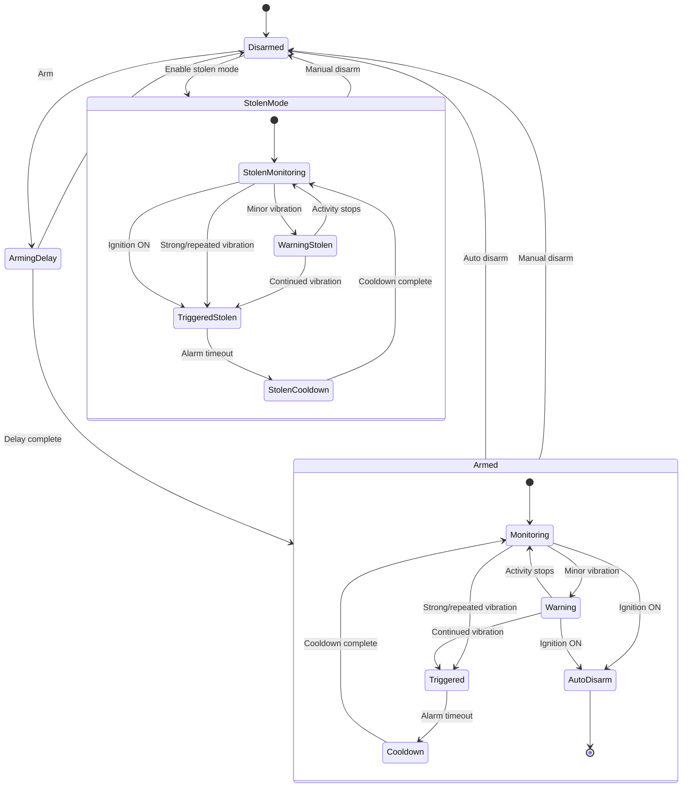

# T-A7670-Alarm-System
LTE-connected alarm system built around the SIMCom A7670 modem for remote monitoring, alerts, and sensor control.

| Name                                 | Value                                |
| ------------------------------------ | ------------------------------------ |
| Board                                | **ESP32 Dev Module**                 |
| Port                                 | Your port                            |
| CPU Frequency                        | 240MHZ(WiFi/BT)                      |
| Core Debug Level                     | None                                 |
| Erase All Flash Before Sketch Upload | Disable                              |
| Events Run On                        | Core1                                |
| Flash Frequency                      | 80MHZ                                |
| Flash Mode                           | QIO                                  |
| Flash Size                           | **4MB(32Mb)**                        |
| JTAG Adapter                         | Disabled                             |
| Arduino Runs On                      | Core1                                |
| Partition Scheme                     | **Huge APP (3MB No OTA/1MB SPIFFS)** |
| PSRAM                                | **Enable**                           |
| Upload Speed                         | 921600                               |
| Programmer                           | **Esptool**                          |

